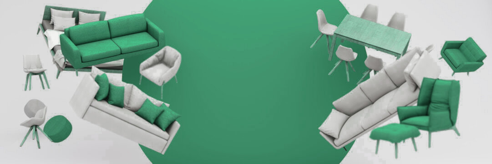

```{r, include = FALSE, message = FALSE}
library(tidyverse)
library(viridis)
library(ggthemes)
library(ggplot2)
library(mapproj)
library(ggrepel)
library(kableExtra)
states <- map_data("state") |>
  rename(
    state = region
  )

dataset <- read_csv("https://raw.githubusercontent.com/gevorgmarg1/furniture_sale_data_analysis/main/stores_sales_forecasting.csv")

dataset <- dataset |>
  select(-`Order ID`, -`Customer ID`, -`Customer Name`, -`Product ID`, -`Row ID`) |>
  rename(
    order_date = `Order Date`,
    ship_date = `Ship Date`,
    ship_mode = `Ship Mode`,
    segment = Segment,
    country = Country,
    state = State,
    postal_code = `Postal Code`,
    region = Region,
    category = Category,
    sub_category = `Sub-Category`,
    product_name = `Product Name`,
    sales = Sales,
    quantity = Quantity,
    discount = Discount,
    profit = Profit
    ) |>
  mutate(
    order_date = mdy(order_date), 
    ship_date = mdy(ship_date),
    postal_code = parse_number(postal_code),
    price = sales/quantity,
    state = tolower(state)
    )

gg_theme <- list(
  theme_minimal(),
  scale_color_brewer(palette="Dark2")
)
```


# Introduction

```{r pressure, echo=FALSE, out.width = '100%'}

```

This paper discusses furniture store sales and aims to suggest information for achieving the most benefit for a furniture selling company. This will be done through data visualization and data analysis in order to find trends. It is important to analyze the data in furniture sales, as the costs of production and risks are high. Each sale might cause loss in profit if multiple details are not taken into account. The process includes the cost of production, the price, the discount and the shipping cost. Given the data of furniture sales, this paper will analyze and suggest possible ways of maximizing profit. The dataset includes 2121 records of sales throughout 2014 to 2017 in the United States. The dataset includes total sales of 8028 products with `$18’451` profit, which in the case of a furniture store is very low for 4 years. Given the fact, analyzing the data of the previous sales, this paper will provide suggestions for maximizing the profit. 


# Shipping

In order to analyze the shipping process, let us look at the difference between the dates of the order and shipping in order to determine any trends over months/seasons and shipping methods. The dataset includes 4 types of shipping methods: Standard Class, Second Class, First Class and Same Day. 

```{r, echo = FALSE, message = FALSE, warning=FALSE, fig.align='center', dev.args = list(bg = 'transparent')}
  #SHIPPING TIME OVER MONTHS
  dataset |>
    mutate(month = month(order_date), ship_time = as.numeric(ship_date-order_date), ship_mode=fct_relevel(ship_mode, c("Standard Class", "Second Class", "First Class","Same Day"))) |>
    group_by(month, ship_mode) |>
    summarize(ship_time = mean(ship_time)) |>
    ggplot(aes(x=month, y=ship_time, color=ship_mode))+
      geom_point() +
      geom_smooth(span=0.3) +
      scale_x_continuous(breaks = 1:12, labels = 1:12) + 
      gg_theme +
  labs(title="Mean shipping time throughout months and categories of products", x="Month", y="Mean Shipping Time \n (Days)", color="Shipping Plan", caption="Source: https://www.kaggle.com/datasets/zahraaalaatageldein/sales-for-furniture-store/data")
  #----------------
```


It can be seen that there is an average of 5 days difference between Standard Class and Same Day, which is a significant difference. Whereas First Class and Second Class are relatively similar with 1 day difference. Based on the popular “Good, Better, Best” pricing strategy it would be preferable to have three options in order to drive users toward picking faster delivery methods which presumably will increase the profit from the order. Therefore, as First Class and Second Class are very similar, they could be merged into one option as 2-3 days delivery.

The data is presented in months, however, there are no significant differences across the months which could have accrued because of weather and other factors. The absence of such trends means that the methods being used for shipping are very reliable. Moreover, this data can be presented to the users in order to prove the reliability of the process.

# Discounts

Another important factor that can decrease profitability is the discount during the sale. Furniture stores usually tend to provide discounts, especially on bigger orders, therefore, it is important to make accountable and beneficial discounts. In this market, the possibility of a customer to return is low,  as the products are long lasting, therefore, the aim of the discount is to only motivate for that one time sale. Below is provided the correlation between discounts and profit made from each transaction.

```{r, echo = FALSE, message = FALSE, warning=FALSE, fig.align='center', dev.args = list(bg = 'transparent')}

  #PROFIT VS DISCOUNT
   dataset |>
    group_by(sub_category, discount)|>
    summarize(mean_profit = mean(profit), discount=discount*100) |>
    ggplot(aes(x=discount, y=mean_profit, color=sub_category)) +
      geom_point() +
      geom_line() +
      geom_hline(yintercept = 0, color="red") +
      facet_wrap(~sub_category, scales = "free") +
      gg_theme +
      labs(title="Correlation between mean profit and discount throughout different categories of products", subtitle="Red horizontal line for break even", color = "Categories of products", x="Discount", y="Mean Profit", caption="Source: https://www.kaggle.com/datasets/zahraaalaatageldein/sales-for-furniture-store/data")
  #--------------

```

The red line indicates the level of 0 profit, meaning that everything lying below the line, causes negative profit, thus lost. As it can be seen in all categories of products, the maximum discount that should be made is at 20%, as any bigger discount leads to loss. However, it is important to remember that the situation might vary based on the segment of customer. For corporate sales, making bigger discounts might be profitable as the customer is more likely to return for other purchases, whereas in case of individuals, the probability of returning is low. 

# Price and Quantity

While making smart discounts is important, it is essential to understand the price point and quantity of the sales in each product category to achieve higher profit. 

```{r, echo = FALSE, message = FALSE, warning=FALSE, fig.align='center', dev.args = list(bg = 'transparent')}
#PRICE AND PROFIT VS QUANTITY 
   price_profit_quant <- dataset |>
    mutate(price=sales/quantity) |>
    filter(price > 5) |>
    group_by(quantity, sub_category) |>
    summarize(mean_price = mean(price), mean_profit = mean(profit)) |>
    pivot_longer(cols=c(mean_price, mean_profit), names_to="type", values_to="value") 
   
   max_price_max_profit <- price_profit_quant |>
     group_by(type, sub_category) |>
     slice_max(value, n=1) |>
     filter(type=="mean_profit")
   
   price_match_max_profit <- dataset |>
    mutate(price=sales/quantity) |>
    filter(price > 5) |>
    group_by(quantity, sub_category) |>
    summarize(mean_price = mean(price), mean_profit = mean(profit)) |>
    right_join(max_price_max_profit|>filter(type=="mean_profit"), join_by(quantity, sub_category))
   
   price_profit_quant |>
     mutate(type=fct_recode(type, "Mean Price" = "mean_price", "Mean Profit"="mean_profit")) |>
    ggplot(aes(x=quantity, y=value, color=sub_category, linetype=type))+
      geom_line() +
      geom_point(data=max_price_max_profit, aes(x=quantity, y=value, color=sub_category))+
      geom_text_repel(data=max_price_max_profit, aes(x=quantity, y=value, color=sub_category, label=round(value,1)))+
      geom_point(data=price_match_max_profit, aes(x=quantity, y=mean_price, color=sub_category)) +
      geom_text_repel(data=price_match_max_profit, aes(x=quantity, y=mean_price, color=sub_category, label=round(mean_price,1))) +
      geom_hline(yintercept=0, color="red") +
      facet_wrap(~sub_category, scales = "free") + 
      gg_theme +
      labs(title="Mean Price And Mean Profit Based On Quantity of Sold Products", subtitle = "Through Different Categories", color="Categories of Products", linetype=" ", x="Quantity", y="Dollar amount", caption="Source: https://www.kaggle.com/datasets/zahraaalaatageldein/sales-for-furniture-store/data")
  #-------------------
```

The graph shows the mean of profit and prices from sales for different categories depending on the quantity of the product. For example, it can be seen that selling 11 chairs at a price of `$250` leads to a very high profit. The red line represents the 0 below which is loss. Let us discuss the cases of various types of products separately.

### Bookcases:
The mean profit line mostly lies under the 0 line, which means that this product has not been very profitable overall, however there are certain price points where the sale has been successful. The maximum profit of 
`$103.6` is reached at the price of `$54` for 9 sold bookcases. Even though there is profit, selling 9 bookcases at a time is challenging and the profit is not as much as expected. Therefore, it would be a good idea to direct the resources towards other types of products. 

### Chairs:
In the case of chairs, the data looks much more promising as there are no loss points, even though the profit line (dotted) gets very close at the sales of small quantities. It can be seen that the maximum profit, `$581`,  is reached at selling 11 chairs for `$250` each. Which is an impressive and reasonable sale. Even though, at low quantities, the profit is not very big, trying to drive customers towards buying bigger quantities of chairs will benefit the company and result in high profits. Therefore, keeping this category is beneficial for the company. 

### Furnishings:
Similar to the chairs, the furnishings show very low profit in small quantities however bring up to average of `$228.4` profit at `$54.6` price each on big quantities. Therefore, keeping this category and especially trying to sell in bigger quantities will be a good decision based on the data analysis.

### Tables:
In case of selling tables, there is usually loss and only a couple of points of sale where there was positive profit. Thus it might be a good idea to limit the sales of tables, or even consider taking tables out of inventory in order to avoid losses.

The data with maximized profit points for each category is presented in the table below, showing the beneficial price and quantity to sell at.


```{r, echo = FALSE, message = FALSE, warning=FALSE, fig.align='center'}

#TABLE PRICE FOR MAX PROFIT
price_match_max_profit |>
  select(1:4) |>
  mutate(mean_price = round(mean_price, 2), mean_profit = round(mean_profit, 2)) |>
  rename(Quantity = quantity, `Product Category` = sub_category, Price= mean_price, `Maximum Profit` = mean_profit) |>
  kable() |>
  kable_styling(bootstrap_options = c("hover"))
#-------------------------
```

# Location

As much as it is important to understand the prices, quantity, discount and shipping methods to drive up the profits for a furniture company, it is also important to consider the location of the business and the placement of the target audience. The below map of the United States shows the distribution of profit throughout the states.

```{r, echo = FALSE, message = FALSE, warning=FALSE, fig.align='center', dev.args = list(bg = 'transparent')}
# MEAN PROFIT OVER STATES
  negative_profit_states <- dataset |>
    group_by(state) |>
    summarize(sum_profit=sum(profit))
  negative_profit_states <- states |>
    group_by(state) |>
    summarize(long = mean(long), lat=mean(lat)) |>
    right_join(negative_profit_states) |>
    filter(sum_profit < 0)
  
  max_profit_states <- dataset |>
    group_by(state) |>
    summarize( sum_profit=sum(profit)) |>
    slice_max(sum_profit, n=1)
    
  max_profit_states <- states |>
    group_by(state) |>
    summarize(long = mean(long), lat=mean(lat)) |>
    right_join(max_profit_states)

  dataset |>
  group_by(state) |>
  summarize(sum_profit=sum(profit)) |>
  left_join(states) |>
  ggplot(aes(long, lat)) +
    geom_polygon(aes(group = group, fill = sum_profit)) + #fill=mean_sales
    coord_map() +
    borders("state", colour="black") +
    scale_fill_gradient(low="#991515", high="#159957") +
    geom_point(data=negative_profit_states, aes(long, lat), color="white") +
    geom_text_repel(data = negative_profit_states, aes(long, lat, label = str_to_title(state)), size = 3, color = "white") +
    geom_point(data=max_profit_states, aes(long, lat), color="darkgreen") +
    geom_text_repel(data = max_profit_states, aes(long, lat, label = str_to_title(state)), size = 3, color = "darkgreen") +
    theme_map() +
    theme(
      plot.background = element_rect(fill=NA, colour=NA),
      legend.background = element_rect(fill = "transparent", colour = NA),
      legend.title = element_text(color = "black"),
      legend.text = element_text(color = "black")) +
    labs(title="Profit of sales throughout the US", fill="Profit", caption="Source: https://www.kaggle.com/datasets/zahraaalaatageldein/sales-for-furniture-store/data")
  #----------------------
```


The amount of profit is represented throughout the color gradient. The states resulting in negative profit are labeled. However, the state with outstandingly high profits, California, is also labeled. Given this data a furniture store might want to locate close to California as most beneficial sales are made there. However, it is also important to be available for other states as well, in order to not lose the other pipes of profit. Even though 10 states result in negative profit, there are 40 other states that bring some kind of positive profit. 


# Conclusion

To conclude, in order to achieve bigger profits, the company should apply some changes in counting discounts, pricing, location and methods of shipping. Overall, targeting a specific type of sales will result in serious achievements. Based on the provided data analysis:

1) There should not be more than 20% discounts on any sales

2) There should be consideration of targeting sales of chairs and furnishings and cutting the production of bookcases and tables

3) Locating the stores in California and other highly profitable states

4) Merging First Class and Second Class shipping methods into one

## References

Elzahra' Ala'. (2024). Sales for Furniture Store [Data set]. Kaggle. https://doi.org/10.34740/KAGGLE/DSV/7648175

Solving the 6 biggest challenges in the furniture sector. Unity Group. (n.d.). https://www.unitygroup.com/blog/solving-the-6-biggest-challenges-in-the-furniture-sector/ 

Viktor Nagornyy. (2023, September 21). You need 3 pricing plans to easily increase revenue. Inbound Method. https://inboundmethod.com/3-pricing-plans-increase-revenue/